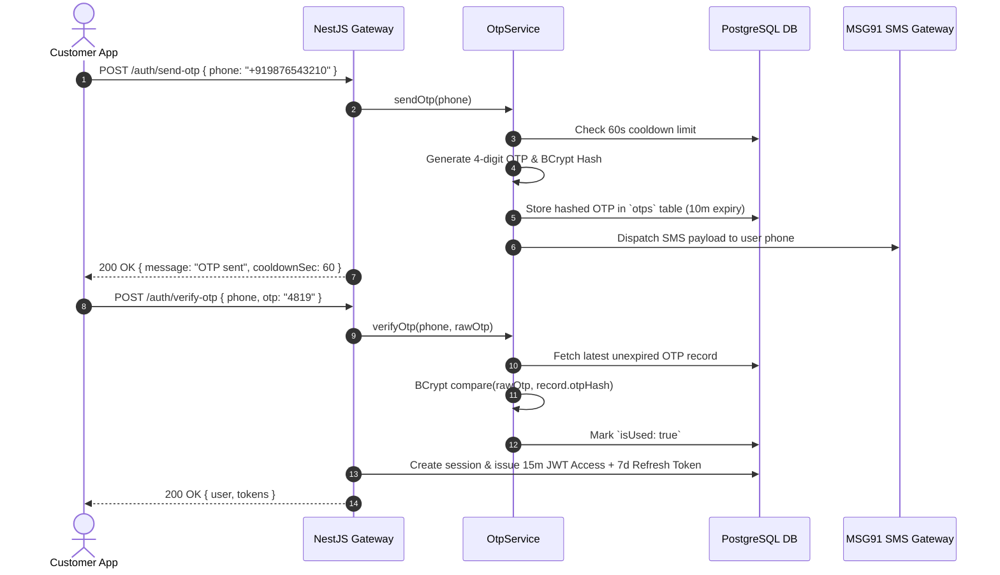
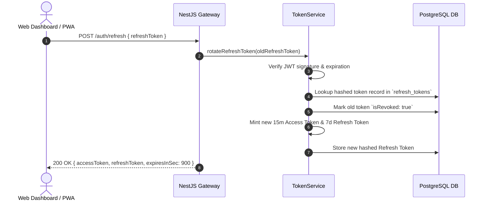

# FoodHub Platform - Production Authentication & Security Specifications

**Document Version:** 1.0.0-PROD  
**Phase:** Phase 3 (Authentication & Authorization Engine)  

---

## 1. MULTI-TENANT AUTHENTICATION MATRIX

FoodHub enforces role-tailored authentication flows across all 7 user personas:

| User Persona | Role Enum | Auth Strategy | Required Credentials | 2FA Required? |
| :--- | :--- | :--- | :--- | :--- |
| **Customer** | `CUSTOMER` | Phone OTP | `phone`, `otp` | No (Passwordless) |
| **Merchant Owner** | `RESTAURANT_OWNER` | Phone + Password | `phone`, `password` | No |
| **Store Manager** | `RESTAURANT_MANAGER` | Phone + Password | `phone`, `password` | No |
| **Kitchen Staff** | `RESTAURANT_STAFF` | Phone + Password | `phone`, `password` | No |
| **Delivery Courier** | `DELIVERY_PARTNER` | Phone + Password | `phone`, `password` | No |
| **Customer Support** | `SUPPORT` | Phone + Password | `phone`, `password` | No |
| **Finance Officer** | `FINANCE` | Phone + Password | `phone`, `password` | No |
| **Platform Admin** | `ADMIN` | Phone + Password + 2FA | `phone`, `password`, `otp` | **Yes (Required)** |
| **Super Admin** | `SUPER_ADMIN` | Phone + Password + 2FA | `phone`, `password`, `otp` | **Yes (Required)** |

---

## 2. SEQUENCE FLOW DIAGRAMS

### 2.1 Customer Passwordless OTP Flow


### 2.2 Refresh Token Rotation Flow


---

## 3. RBAC SECURITY MATRIX & DECORATORS

### 3.1 Role Guard Usage Example
```typescript
@Controller('admin/merchants')
@UseGuards(JwtAuthGuard, RolesGuard)
export class AdminMerchantController {
  @Get()
  @Roles(UserRole.ADMIN, UserRole.SUPER_ADMIN)
  async getMerchantList() {
    // Only Admin & SuperAdmin allowed
  }
}
```

### 3.2 Granular Permission Guard Usage Example
```typescript
@Controller('users')
@UseGuards(JwtAuthGuard, PermissionsGuard)
export class UserManagementController {
  @Post()
  @RequirePermissions('users:write')
  async createUser() {
    // Requires explicit 'users:write' permission in DB
  }
}
```

---

## 4. API ENDPOINTS REFERENCE SUMMARY

| Endpoint Method & Path | Auth Required | Description |
| :--- | :--- | :--- |
| `POST /api/v1/auth/send-otp` | Public | Send 4-digit SMS OTP (60s cooldown, 10m expiry). |
| `POST /api/v1/auth/verify-otp` | Public | Verify OTP and return JWT access/refresh tokens. |
| `POST /api/v1/auth/login` | Public | Password login for Merchant/Courier/Admin (Triggers 2FA for Admin). |
| `POST /api/v1/auth/logout` | Bearer JWT | Terminate current device session. |
| `POST /api/v1/auth/logout-all` | Bearer JWT | Terminate all active device sessions across all platforms. |
| `POST /api/v1/auth/refresh` | Public | Rotate 7-day Refresh Token and return new 15m Access Token. |
| `POST /api/v1/auth/forgot-password` | Public | Request password reset SMS OTP. |
| `POST /api/v1/auth/reset-password` | Public | Verify reset OTP and update account password (enforces security policy). |
| `POST /api/v1/auth/change-password` | Bearer JWT | Update password for authenticated user. |
| `GET /api/v1/auth/profile` | Bearer JWT | Fetch user identity and profile details. |
| `PATCH /api/v1/auth/profile` | Bearer JWT | Update profile details (first name, last name, avatar URL). |
| `GET /api/v1/auth/sessions` | Bearer JWT | List all active login sessions for user. |
| `DELETE /api/v1/auth/session/:id` | Bearer JWT | Revoke specific device session by UUID. |
