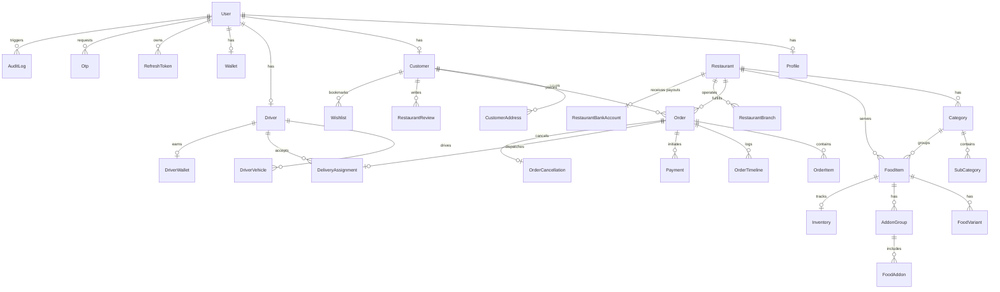

# FoodHub Platform - Database Design & Relational Specifications

**Document Version:** 1.0.0-PROD  
**Phase:** Phase 2 (Database Design & Prisma Foundation)

---

## 1. ENTITY RELATIONSHIP DIAGRAM (MERMAID ERD)



---

## 2. DATA DICTIONARY & MODULE SCHEMAS SUMMARY

### Module 1: Authentication & Users

- `users`: Core identity table storing phone, email, password hash, role enum, and soft delete state.
- `profiles`: 1:1 user profile details (first name, last name, avatar URL, FCM push token).
- `roles` & `permissions`: RBAC matrix mapping roles (`SUPER_ADMIN`, `ADMIN`, `HOTEL_OWNER`, `HOTEL_STAFF`, `DELIVERY_PARTNER`, `CUSTOMER`, `SUPPORT`, `FINANCE`) to explicit permission string actions (`users:read`, `restaurants:manage`, etc.).
- `refresh_tokens`: Revokable JWT refresh token hashes with expiration timestamps.
- `otps`: Hashed MSG91 SMS OTP codes with 60-second validity checks.

### Module 2: Customer Domain

- `customers`: Customer persona reference linked 1:1 with `users`.
- `customer_addresses`: Saved delivery locations with spatial latitude and longitude coordinates.
- `wishlists` & `saved_restaurants`: Customer favorite dishes and restaurant bookmarks.

### Module 3: Restaurant Domain

- `restaurants`: Store master listing containing FSSAI license, GSTIN, spatial location, rating (`Decimal(3,2)`), status enum, and commission rate.
- `restaurant_branches` & `restaurant_timings`: Multi-outlet support & 7-day operating hours matrix.
- `restaurant_documents`: Verified FSSAI, GSTIN, and bank cheque uploads.
- `restaurant_bank_accounts`: Merchant settlement bank account details.

### Module 4: Menu & Catalog Domain

- `categories` & `sub_categories`: Hierarchical menu categorization with custom display ordering.
- `food_items`: Dish catalog items with prices (`Decimal(10,2)`), veg/non-veg tags, and stock availability toggles.
- `food_variants` & `addon_groups`: Multi-size choices (Small, Medium, Large) and customization addon groups (Extra Cheese, Choice of Sauce).
- `inventories`: Real-time inventory stock count tracker per dish.

### Module 5: Orders Domain

- `orders`: Deterministic 12-state order lifecycle table (`PENDING`, `ACCEPTED`, `PREPARING`, `READY_FOR_PICKUP`, `DRIVER_ASSIGNED`, `OUT_FOR_DELIVERY`, `DELIVERED`, `CANCELLED`, `REFUNDED`). Includes Subtotal, Packaging Fee, Delivery Fee, Tax, Discount, Total Amount, and 4-digit Delivery OTP.
- `order_items`: Order line items with price snapshots and addon selections.
- `order_timelines` & `order_status_histories`: Immutable chronological order status transition logs.

### Module 6: Payments & Wallet Domain

- `payments`: Razorpay transaction records (`razorpay_order_id`, `razorpay_payment_id`, `razorpay_signature`, method, status).
- `wallets` & `wallet_transactions`: In-app customer wallet balance with double-entry ledger credit/debit records.

### Module 7: Delivery Domain

- `drivers`: Courier profile linked 1:1 to `users`, license number, vehicle type, duty status (`OFFLINE`, `ONLINE`, `BUSY`), and current GPS coordinates.
- `delivery_assignments`: Geofenced dispatch offers, acceptance timestamps, pickup/dropoff logs, and courier payout calculation.

---

## 3. MIGRATION & SEEDING EXECUTION GUIDE

### Step 1: Execute Schema Migration

```bash
# Apply Prisma migration to local PostgreSQL database
pnpm --filter backend exec prisma migrate dev --name init_phase2_schema
```

### Step 2: Seed Foundation Data

```bash
# Seed System Roles, Permissions, SuperAdmin User, Settings, Feature Flags, and Coupons
pnpm --filter backend run prisma:seed
```

### Step 3: Validate Generated Client

```bash
# Validate Prisma Schema & Regenerate Client
pnpm --filter backend exec prisma validate
pnpm --filter backend exec prisma generate
```
