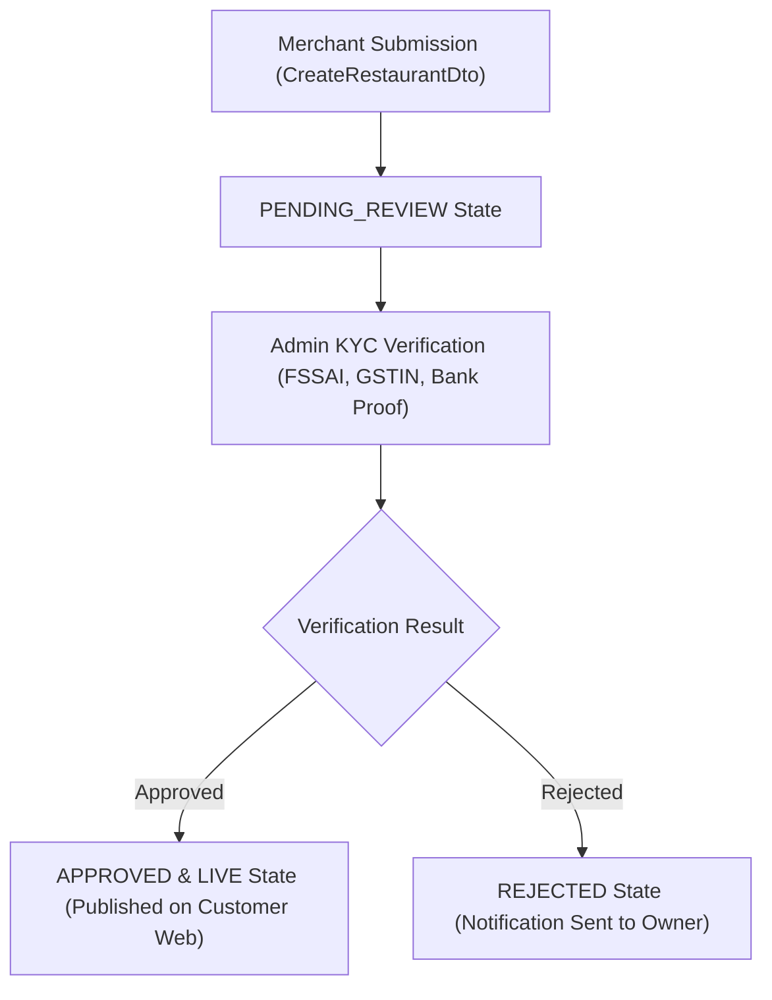

# FoodHub Platform - Restaurant Management & Menu Inventory Architecture

**Document Version:** 1.0.0-PROD  
**Phases Covered:** Phase 8 (Restaurant Management) & Phase 9 (Menu & Inventory System)

---

## 1. PHASE 8: RESTAURANT ONBOARDING WORKFLOW



### Restaurant Data Schema & Verification Attributes

- **Core Info:** `name`, `slug`, `ownerName`, `phone`, `email`, `address`, `cuisines`.
- **KYC Compliance:** FSSAI License Number (`14-digit`), GSTIN Registration (`15-char`), Bank Account & IFSC.
- **Operating Hours & Delivery:** Working days, opening/closing hours, packaging charges, base prep time.

---

## 2. PHASE 9: MENU & INVENTORY HIERARCHY

```
Restaurant
└── Category (e.g. Main Course, Biryani, Desserts)
    └── SubCategory
        └── FoodItem (e.g. Paneer Butter Masala)
            ├── Attributes: Price, Veg/NonVeg/Egg/Jain, Calories, PrepTime
            ├── Variants (Portion Size: Small, Medium, Large, Family Pack)
            └── AddonGroup (e.g. Choice of Topping, Extra Cheese)
                └── Addon (Extra Cheese Slice +₹40)
```

### Inventory Auto-Disabling Logic

- Real-time stock counter tracked on `FoodItem` and `Variant` records.
- Stock transitions: `IN_STOCK` (stock >= 10) ➔ `LOW_STOCK` (stock < 10) ➔ `OUT_OF_STOCK` (stock == 0).
- When stock reaches 0, `isAvailable` flag is automatically toggled to `false`, preventing customer checkout failures.

---

## 3. REST API ENDPOINTS SPECIFICATION

| Method  | Endpoint                               | Description                                    | Auth Required |
| :------ | :------------------------------------- | :--------------------------------------------- | :------------ |
| `POST`  | `/api/v1/restaurants`                  | Submit new restaurant registration             | Public        |
| `GET`   | `/api/v1/restaurants`                  | List registered restaurants                    | Public        |
| `GET`   | `/api/v1/restaurants/:id`              | Get restaurant details by ID                   | Public        |
| `PATCH` | `/api/v1/restaurants/:id/approval`     | Approve or Reject restaurant onboarding        | Admin Only    |
| `POST`  | `/api/v1/menus/items`                  | Create new food item in menu catalog           | Merchant      |
| `GET`   | `/api/v1/menus/restaurant/:id`         | Get full menu hierarchy with variants & addons | Public        |
| `PATCH` | `/api/v1/menus/items/:id/availability` | Toggle in-stock / out-of-stock availability    | Merchant      |
